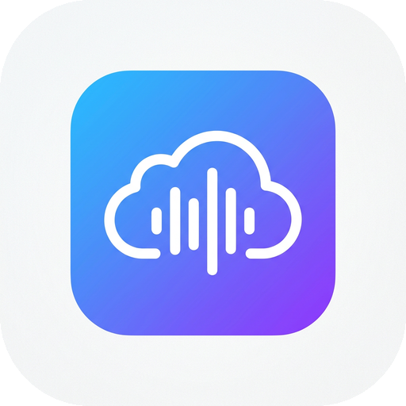
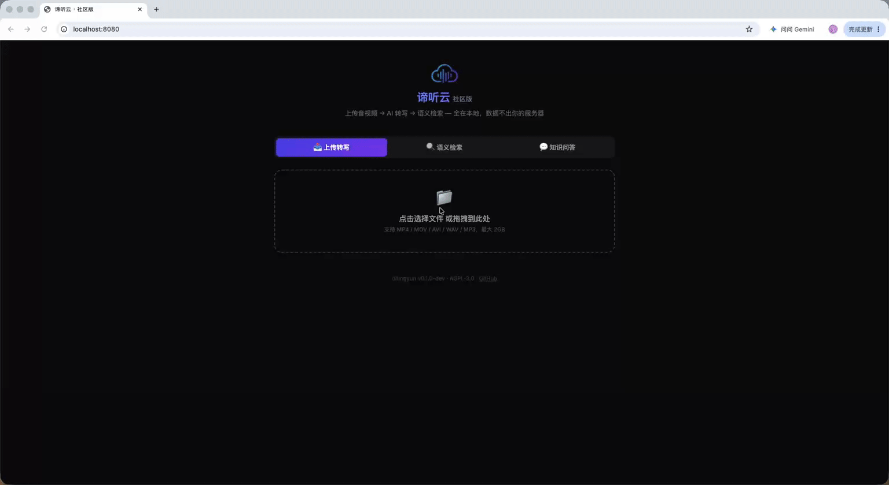

<div align="center">
  
  <h1>谛听云 DiTingYun</h1>
  <p><strong>用 5 分钟，在本地为团队搭建一个私有化 AI 音视频知识库</strong></p>
  <p>
    上传会议录屏、培训视频、客户访谈 — AI 自动转写、清洗纠错、建立语义索引。<br />
    没有黑盒，没有暗桩，所有数据留在你自己的服务器上。
  </p>
  <p>
    <a href="LICENSE"></a>
    
    
    
  </p>

  

  <p>
    <a href="https://ditingyun.cn">官网</a> ·
    <a href="https://ditingyun.cn/#security">云端托管版</a> ·
    <a href="docs/architecture.md">架构文档</a> ·
    <a href="https://github.com/DiTingAI/ditingyun/issues">问题反馈</a>
  </p>
</div>

---

> 🚧 **项目处于 MVP 快速迭代阶段**，核心管道正在密集构建。欢迎 Star 关注进展，也欢迎提前加入讨论区参与设计。

## ✨ 特性

- **🎙️ 音视频转写** — 接入 Whisper（云端 API 或本地 whisper.cpp），会议录屏、培训视频一键转文字
- **🧹 AI 清洗纠错** — 自动过滤语气词、修正专业术语，输出干净可读的逐字稿
- **🔍 语义检索** — 不是关键词匹配，是自然语言检索：输入问题，直接定位到原话所在的时间戳
- **💬 知识问答（RAG）** — 基于团队全部音视频资产提问，答案自带出处引用
- **🔒 完全私有化** — 单容器运行，数据不出你的服务器；代码完全开源，随时审查
- **🐳 5 分钟部署** — `docker compose up -d`，一条命令跑起整个系统

## 🚀 快速开始

**前置要求**：已安装 Docker。

```bash
git clone https://github.com/DiTingAI/ditingyun.git
cd ditingyun
cp .env.example .env   # 填入你的 OpenAI 兼容 API Key
docker compose up -d
```

打开 **http://localhost:8080**，上传第一段视频，开始构建你的知识库。

> 💡 不想用云端 API？Roadmap 中的本地 whisper.cpp 支持将实现**零 API Key、完全离线**运行。

## 🏗️ 架构

```
                上传音视频
                    │
                    ▼
        ┌────────────────────────┐
        │    ditingyun-server     │   Go 单二进制，零外部服务依赖
        └───────────┬────────────┘
                    │
     ┌──────────────┼───────────────┐
     ▼              ▼               ▼
┌─────────┐   ┌───────────┐   ┌────────────┐
│ ASR 转写 │   │ LLM 清洗   │   │ 向量索引    │
│ Whisper │   │ 术语纠错   │   │ SQLite 内嵌 │
└─────────┘   └───────────┘   └────────────┘
     │              │               │
     └──────────────┴───────────────┘
                    ▼
          语义检索 / 知识问答
          （答案自带时间戳出处）
```

详细设计取舍见 [docs/architecture.md](docs/architecture.md)。

## 📦 社区版 vs 云端版（Open-Core）

| 能力 | 社区版（本仓库） | 谛听云云端版 |
| --- | --- | --- |
| 音视频转写 + 清洗 | ✅ | ✅ |
| 语义检索 + 知识问答 | ✅ 单机 | ✅ 分布式集群 |
| 部署方式 | Docker 自托管 | 免运维托管 |
| 团队协作 / 多级权限（RBAC） | ❌ | ✅ |
| 企业自研术语纠错与优化 | ❌ | ✅ |
| 多租户隔离 / 审计 / SLA | ❌ | ✅ |
| 私有化部署 + 商业授权 | ❌ | ✅ <a href="https://ditingyun.cn">咨询</a> |

社区版永远免费、永远开源。云端版为「不想折腾服务器、需要团队协同与合规」的企业而生。

## 🗺️ Roadmap

- [x] 仓库初始化 · AGPL-3.0
- [ ] **v0.1.0 MVP**：上传 → 转写 → 纠错 → 检索 → 问答 全链路
- [ ] 本地 whisper.cpp 支持，零 API Key 完全离线运行
- [ ] 说话人分离（自动区分会议发言人）
- [ ] 中文专业术语纠错词库（社区共建）
- [ ] Web 管理台 UI

## 🤝 参与贡献

项目刚刚起步，每一个 Issue、PR 和建议都弥足珍贵：

1. Fork 本仓库并创建特性分支
2. 提交 PR 前请确保 `go build ./...` 通过
3. 重大改动请先在 Issue 中讨论

## 📄 开源协议

本项目采用 **AGPL-3.0** 协议开源：

- ✅ 你可以自由使用、修改、在**企业内部**部署
- ⚠️ 如果你基于本项目修改并**通过网络对外提供 SaaS 服务**，必须开源你的完整修改
- 💼 需要闭源二次开发或商业分发？请联系我们获取**商业授权**

---

<div align="center">
  <sub>如果这个项目对你有帮助，请给我们一颗 ⭐ Star — 这是开源作者最大的动力。</sub>
</div>
